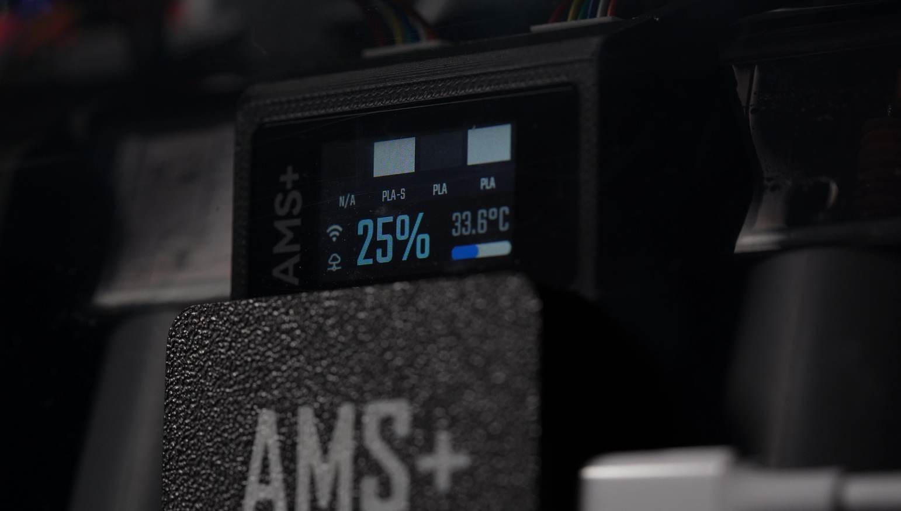
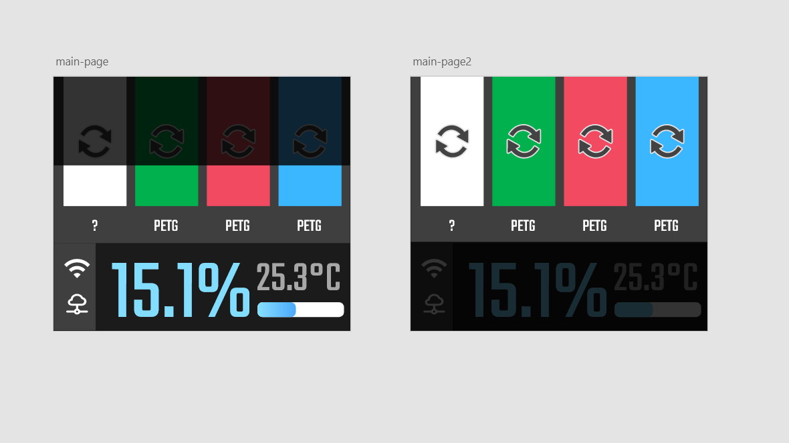
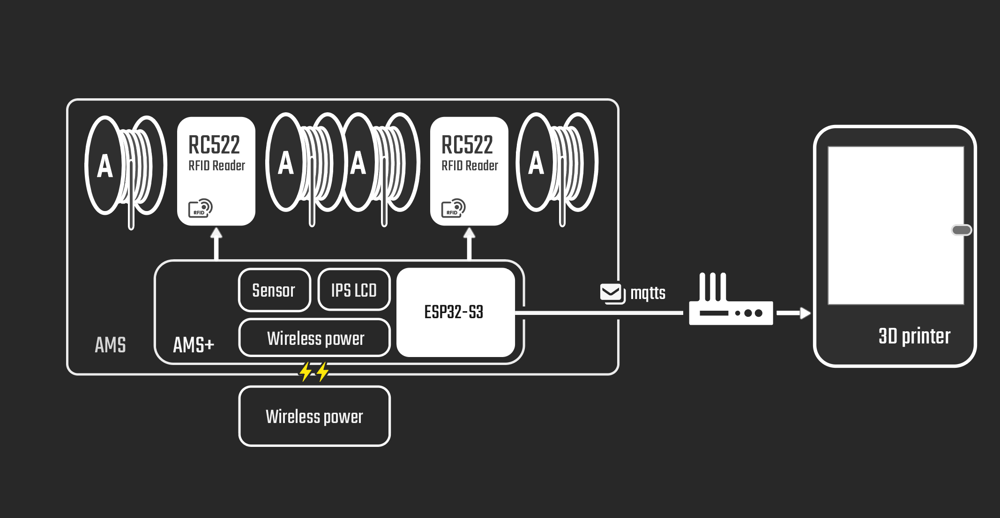
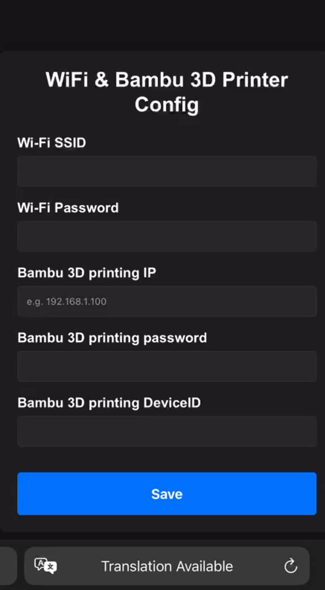

# AMS Plus

[中文](./README_CN.md) | English

AMS Plus is an extension device for the Bambu 3D printer's Automatic Material System (AMS) designed to support the automatic identification of third-party filaments.





## Hardware Components

- **Main Chip**: ESP32S3
- **RFID Module**: Two RC522 modules for reading NTAG tags attached to third-party filaments
- **Sensor Module**: Temperature and humidity sensor to monitor the internal environment of the AMS
- **Display**: 1.14-inch LCD screen for displaying filament information and environmental data
- **Power Supply Module**: Wireless power supply to ensure seamless operation

## Working Principle

1. **RFID Reading**: NTAG tag information attached to third-party filaments is read by the RC522 module.
2. **Data Transmission**: Filament information is sent to the 3D printer via MQTT protocol.
3. **Information Display**: The LCD screen displays real-time filament information and the AMS's internal temperature and humidity.



## Installation and Usage

1. **Hardware Connection**: Connect all modules to the ESP32S3 as per the hardware configuration.
2. **Software Configuration**: Use ESP-IDF 5.1 to compile and flash the firmware.
3. **AMS Plus Configuration**:
   1. Upon first use, the device will enter configuration mode and display a Wi-Fi network name on the screen.
   2. Connect to the displayed Wi-Fi network, and the screen will show a QR code. Scan the QR code or manually enter `192.168.4.1` in your browser to access the configuration page.
   3. On the configuration page, input the necessary parameters. Note that AMS Plus only supports 2.4GHz Wi-Fi and must be on the same subnet as the Bambu 3D Printer.
   4. Once configuration is complete, the device will restart and connect to the 3D printer. If the connection fails, repeat steps 2-3.
4. **Tag Writing**: Use a smartphone application that supports NTAG technology to write filament information onto the tags and attach them to third-party filaments.
5. **Device Installation**: Install AMS Plus inside the AMS, ensuring that the wireless power supply works properly.



## Repository File Structure

Here is the structure of the AMSPlusCore repository:

```
AMSPlusCore/
├── AMSPlusDocs      # Documentation related to AMSPlus
├── AMSPlusWebPage   # AMSPlus tag generation webpage
├── firmware         # Firmware directory
│   ├── components   # Firmware dependencies
│   ├── main         # Firmware main function
└── image            # Image directory
```

## TODO
- Add support for multiple AMS units
- Track filament usage and write the data to NTAG tags
- Develop and upload web-based code for generating NTAG tag data

## Contribution

We welcome suggestions and contributions to the AMS Plus project. Please submit issues or pull requests via GitHub.

## License

This project is licensed under the MIT License. For details, see the LICENSE file.

## Acknowledgments

Special thanks to the following open-source projects for their support and inspiration in developing AMS Plus:

- **[RFID-Tag-Guide](https://github.com/Bambu-Research-Group/RFID-Tag-Guide)**: Provided detailed guidance and technical references for RFID tags.
- **[OpenBambuAPI](https://github.com/Doridian/OpenBambuAPI/tree/main)**: Offered an open API for Bambu printers.
- **[OpenSpool](https://github.com/spuder/OpenSpool)**: Inspired filament information management.
- **[esp-idf-rc522](https://github.com/abobija/esp-idf-rc522)**: Provided driver support for integrating RC522 modules with ESP32S3.
