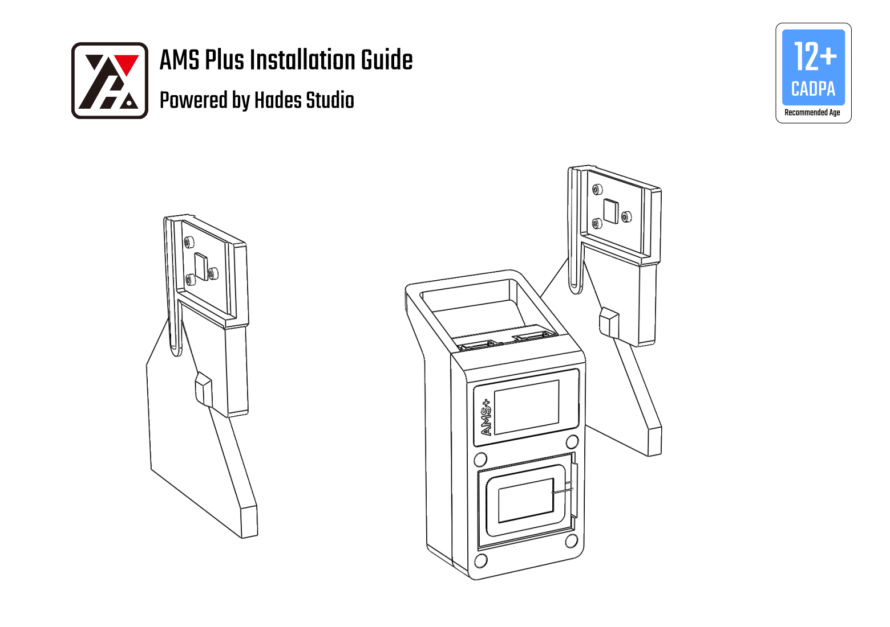
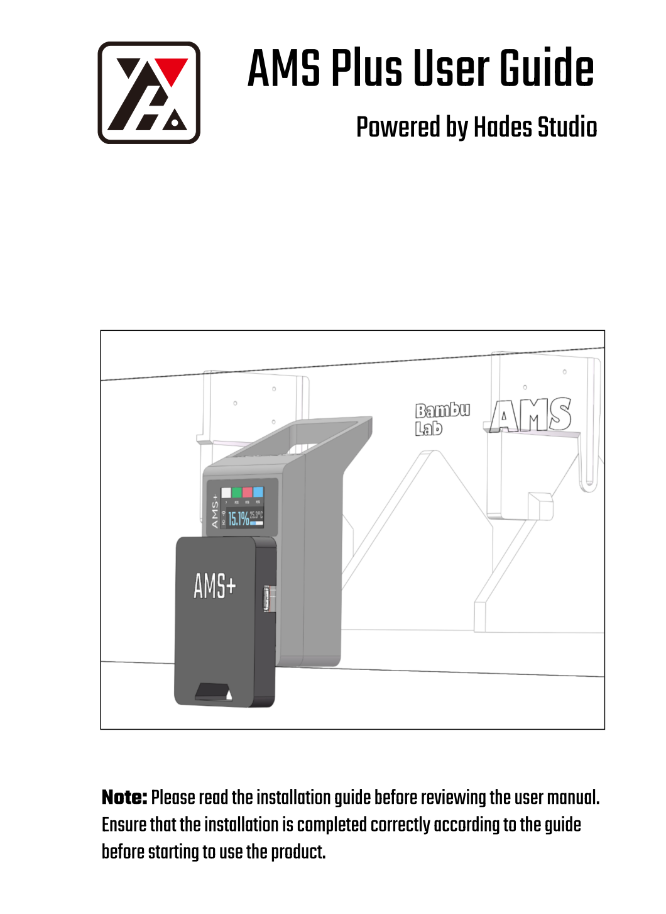

# AMS Plus

[中文](./README_CN.md) | English

AMS Plus is an extension device for the Bambu 3D printer's Automatic Material System (AMS) designed to support the automatic identification of third-party filaments.

> [!IMPORTANT]
>
> Please note that the latest security update from Bambu will cause this project to become ineffective. The current version of the project requires MQTTS support. If you wish to continue using the project, please keep an eye on Bambu’s latest announcements and either retain the current firmware version or run in developer mode.

[](https://discord.gg/pPbW6hNzwe)


## Hardware Components

- **Main Chip**: ESP32S3
- **RFID Module**: Two RC522 modules for reading NTAG tags attached to third-party filaments
- **Sensor Module**: Temperature and humidity sensor to monitor the internal environment of the AMS
- **Display**: 1.14-inch LCD screen for displaying filament information and environmental data
- **Power Supply Module**: Wireless power supply to ensure seamless operation

## Working Principle

1. **RFID Reading**: NTAG tag information attached to third-party filaments is read by the RC522 module.
2. **Data Transmission**: Filament information is sent to the 3D printer via MQTT protocol.
3. **Information Display**: The LCD screen displays real-time filament information and the AMS's internal temperature and humidity.


## Installation and Usage


Refer to the guidance documents in [AMSPlusDocs](https://github.com/Hades2001/AMSPlusDocs)

Installation_Guide/: [Installation Guide](https://github.com/Hades2001/AMSPlusDocs/blob/main/Installation_Guide/AMSPlus_Installation_Guide_V13.pdf)

user_Guide/: [Usage Guide](https://github.com/Hades2001/AMSPlusDocs/blob/main/user_Guide/AMSPlus_User_Guide.drawio.pdf)


## Repository File Structure

Here is the structure of the AMSPlusCore repository:

```
AMSPlusCore/
├── AMSPlusDocs      # Documentation related to AMSPlus
├── AMSPlusWebPage   # AMSPlus tag generation webpage
├── firmware         # Firmware directory
│   ├── components   # Firmware dependencies
│   ├── main         # Firmware main function
└── image            # Image directory
```

## TODO
- Add support for multiple AMS units
- Track filament usage and write the data to NTAG tags
- Develop and upload web-based code for generating NTAG tag data

## Thanks to the following individuals for their support: 


|   |   |   |
| --- | --- | --- |
|  | [EeeeBin](https://github.com/EeeeBin) | Technical support for ESP32S3-related optimizations |
|  | [ggadc](https://github.com/ggadc)     | Code support for UI/LVGL development      

## Contribution 

We welcome suggestions and contributions to the AMS Plus project. Please submit issues or pull requests via GitHub.


## License

This project is licensed under the MIT License. For details, see the LICENSE file.

## Acknowledgments

Special thanks to the following open-source projects for their support and inspiration in developing AMS Plus:

- **[RFID-Tag-Guide](https://github.com/Bambu-Research-Group/RFID-Tag-Guide)**: Provided detailed guidance and technical references for RFID tags.
- **[OpenBambuAPI](https://github.com/Doridian/OpenBambuAPI/tree/main)**: Offered an open API for Bambu printers.
- **[OpenSpool](https://github.com/spuder/OpenSpool)**: Inspired filament information management.
- **[esp-idf-rc522](https://github.com/abobija/esp-idf-rc522)**: Provided driver support for integrating RC522 modules with ESP32S3.
