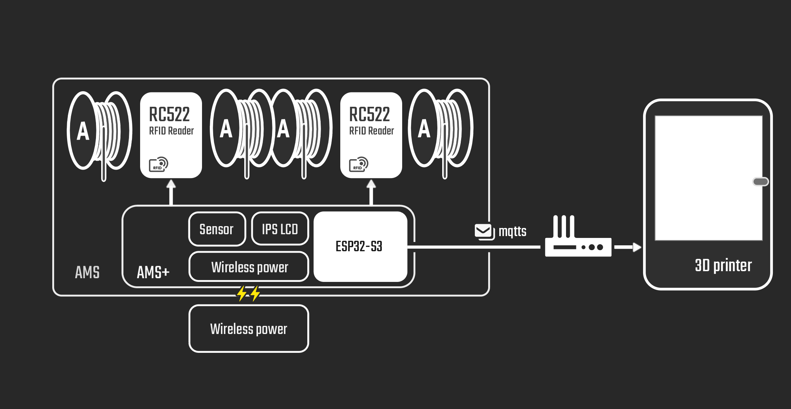

# AMS Plus

中文 [English](./README.md)

AMS Plus 是一个用于 Bambu 3D 打印机的多色换料器（AMS）的扩展设备，旨在支持自动识别第三方耗材。


## 硬件组成

- **主控芯片**：ESP32S3
- **RFID 模块**：两个 RC522 模块，用于读取粘贴于第三方耗材上的 NTAG 标签
- **传感器模块**：温湿度传感器，用于监测 AMS 内部环境
- **显示屏**：1.14 英寸液晶屏，用于显示耗材信息和环境数据
- **供电模块**：无线供电模块，确保设备正常运行

## 工作原理

1. **RFID 读取**：通过 RC522 模块读取粘贴在第三方耗材上的 NTAG 标签信息。
2. **数据传输**：使用 MQTT 协议，将读取的耗材信息发送至 3D 打印机。
3. **信息显示**：液晶屏实时显示当前耗材信息以及 AMS 内部的温湿度。



## 安装与使用

1. **硬件连接**：按照硬件组成部分，将各模块与 ESP32S3 连接。
2. **软件配置**：使用 ESP-IDF 5.1 编译并烧录固件。
3. **AMS Plus配置**：
   1. 首次使用会进入到配置页面，连接到屏幕上显示的Wi-Fi名称。
   2. 连接成功后，设备屏幕会显示二维码，扫描二维码或者手动在浏览器地址栏输入192.168.4.1跳转到配置页面。
   3. 配置页面输入用于连接的参数，注意AMS Plus仅支持2.4G频段的Wi-Fi，且AMS Plus要与Bambu 3D Pinter处于同一网段。
   4. 配置完成后设备重启并连接到3D打印机，如果连接失败，请重复地2-3步。
4. **标签写入**：使用支持 NTAG 技术的手机应用，将耗材信息写入标签，并粘贴于第三方耗材上。
5. **设备安装**：将 AMS Plus 安装至 AMS 内部，确保无线供电正常工作。


## 仓库文件结构

以下是 AMSPlusCore 仓库的文件结构：

```
AMSPlusCore/
├── AMSPlusDocs      # AMSPlus 的相关文档
├── AMSPlusWebPage   # AMSPlus 标签生成网页
├── firmware         # 固件目录
│   ├── components   # 固件依赖组件
│   ├── main         # 固件主函数
└── image            # 图片目录
```
## TODO
* 增加存在多台AMS的支持
* 记录耗材用量并写入NTAG标签
* 创建并上传用于生成NTAG便签数据的web端代码

## 贡献

欢迎对 AMS Plus 项目提出建议或贡献代码。请通过 GitHub 提交 issue 或 pull request。

## 许可证

本项目遵循 MIT 许可证。详情请参阅 LICENSE 文件。

## 致谢

感谢以下开源项目为 AMS Plus 的开发提供了支持和灵感：

- **[RFID-Tag-Guide](https://github.com/Bambu-Research-Group/RFID-Tag-Guide)**：提供了关于 RFID 标签的详细指南和技术参考。
- **[OpenBambuAPI](https://github.com/Doridian/OpenBambuAPI/tree/main)**：为 Bambu 打印机提供了开放的 API 支持。
- **[OpenSpool](https://github.com/spuder/OpenSpool)**：对耗材信息管理提供了灵感和参考。
- **[esp-idf-rc522](https://github.com/abobija/esp-idf-rc522)**：为 ESP32S3 集成 RC522 模块提供了驱动支持。
